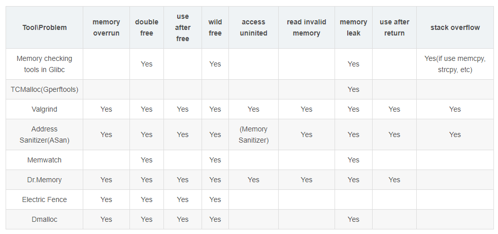

<!-- TOC -->- [1. 工具比较](#1-工具比较)auto- [2. Asan](#2-asan)auto    - [2.1. 概述](#21-概述)auto    - [2.2. 安装使用](#22-安装使用)auto    - [2.3. 参数说明](#23-参数说明)auto    - [2.4. 简单使用](#24-简单使用)auto- [3. valgrind](#3-valgrind)auto    - [3.1. 概述](#31-概述)auto    - [3.2. 安装](#32-安装)auto    - [3.3. 检测类型](#33-检测类型)auto    - [3.4. 参数类型](#34-参数类型)auto    - [3.5. 问题](#35-问题)auto- [4. 其他工具](#4-其他工具)auto    - [4.1. mtrace](#41-mtrace)auto    - [4.2. dmalloc](#42-dmalloc)auto    - [4.3. Kmemleak](#43-kmemleak)auto    - [4.4. Gperftools](#44-gperftools)autoauto<!-- /TOC -->
# 1. 工具比较
[here](https://blog.csdn.net/jinzhuojun/article/details/46659155)
工具|描述
---|---
[valgrind](http://elinux.org/Memory_Debuggers#valgrind)|	一个强大开源的程序检测工具
[mtrace](http://elinux.org/Memory_Debuggers#mtrace)	|GNU扩展, 用来跟踪malloc, mtrace为内存分配函数（malloc, realloc, memalign, free）安装hook函数
[dmalloc](https://blog.csdn.net/gatieme/article/details/51959654_)|	用于检查C/C++内存泄露(leak)的工具，即检查是否存在直到程序运行结束还没有释放的内存,以一个运行库的方式发布
[memwatch](http://mpatrol.sourceforge.net/)|	和dmalloc一样，它能检测未释放的内存、同一段内存被释放多次、位址存取错误及不当使用未分配之内存区域
[mpatrol](http://mpatrol.sourceforge.net/)	|一个跨平台的 C++ 内存泄漏检测器
[dbgmem](http://dbgmem.sourceforge.net/)	|
[Electric Fence](http://elinux.org/Electric_Fence)|	
Kmemleak|Linux内核的Kmemleak是内核自带的内核泄露检测工具



# 2. Asan
## 2.1. 概述
[官方文档](https://github.com/google/kasan/wiki)
[中文资料](http://www.cppblog.com/markqian86/archive/2018/04/17/215594.aspx)


Sanitizers是谷歌发起的开源工具集，Sanitizers包括AddressSanitizer, MemorySanitizer, ThreadSanitizer, LeakSanitizer。
Sanitizers项目本是LLVM项目的一部分，但GNU也将该系列工具加入到了自家的GCC编译器中。
将asan的程序放到线上去跑，对程序的性能影响不大。

从gcc 4.8开始，AddressSanitizer成为gcc的一部分。当然，要获得更好的体验，最好使用4.9及以上版本，因为gcc 4.8的AddressSanitizer还不完善，最大的缺点是没有符号信息。
<font color='red'>切记:需要内存泄漏检查，需要安装GCC4.9或更高版本。GCC从4.8版本开始支持Address和Thread Sanitizer，但是从4.9版本才开始支持Leak Sanitizer和UB Sanitizer</font>

**常用语法格式**：
<u>编译时使用`-fsanitize=address -fno-omit-frame-pointer`或者`-g -O2 -fsanitize=address -fno-omit-frame-pointer`。
-fsanitize=address命令就是将asan编译进来。</u>编译的.o文件在运行时stack上申请的内存都会被asan接管，如果出问题，asan会第一时间输出报告，如内存越界和非法访问。参数`-fno-onit-frame-pointer`可以防止一些优化导致内存丧失可读性，链接时使用-fsanitize=address -fno-omit-frame-pointer选项可以让程序在heap上申请的内存被asan接管，这样asan会监控new和delete来输出内存报告。

<u>可以在执行程序时，加入各种flags进行微调，例如：`ASAN_OPTIONS=detect_leaks=1 LSAN_OPTIONS=suppressions=suppr.txt ./a.out`,打开内存泄漏检查，传入抑制文件</u>

**检测结果举例**：
下面是一个检测的栈溢出结果
```C++
==14559== ERROR: AddressSanitizer: stack-buffer-overflow on address 0x7ffe7dee6724 at pc 0x400a97 bp 0x7ffe7dee6530 sp 0x7ffe7dee6520
READ of size 4 at 0x7ffe7dee6724 thread T0
    #0 0x400a96 (/root/VsWorkplace/0asan/All_Memory_Errors/a.out+0x400a96)
    #1 0x7f937f3563d4 (/usr/lib64/libc-2.17.so+0x223d4)
    #2 0x4008c8 (/root/VsWorkplace/0asan/All_Memory_Errors/a.out+0x4008c8)
Address 0x7ffe7dee6724 is located at offset 436 in frame <main> of T0's stack:
  This frame has 1 object(s):
    [32, 432) 'stack_array'
HINT: this may be a false positive if your program uses some custom stack unwind mechanism or swapcontext
      (longjmp and C++ exceptions *are* supported)
Shadow bytes around the buggy address:
  0x10004fbd4c90: 00 00 00 00 00 00 00 00 00 00 00 00 00 00 00 00
  0x10004fbd4ca0: 00 00 00 00 00 00 00 00 00 00 00 00 00 00 f1 f1
  0x10004fbd4cb0: f1 f1 00 00 00 00 00 00 00 00 00 00 00 00 00 00
  0x10004fbd4cc0: 00 00 00 00 00 00 00 00 00 00 00 00 00 00 00 00
  0x10004fbd4cd0: 00 00 00 00 00 00 00 00 00 00 00 00 00 00 00 00
=>0x10004fbd4ce0: 00 00 00 00[f4]f4 f3 f3 f3 f3 00 00 00 00 00 00
  0x10004fbd4cf0: 00 00 00 00 00 00 00 00 00 00 00 00 00 00 00 00
  0x10004fbd4d00: 00 00 00 00 00 00 00 00 00 00 00 00 00 00 00 00
  0x10004fbd4d10: 00 00 00 00 00 00 00 00 00 00 00 00 00 00 00 00
  0x10004fbd4d20: 00 00 00 00 00 00 00 00 00 00 00 00 00 00 00 00
  0x10004fbd4d30: 00 00 00 00 00 00 00 00 00 00 00 00 00 00 00 00
Shadow byte legend (one shadow byte represents 8 application bytes):
  Addressable:           00
  Partially addressable: 01 02 03 04 05 06 07 
  Heap left redzone:     fa
  Heap righ redzone:     fb
  Freed Heap region:     fd
  Stack left redzone:    f1
  Stack mid redzone:     f2
  Stack right redzone:   f3
  Stack partial redzone: f4
  Stack after return:    f5
  Stack use after scope: f8
  Global redzone:        f9
  Global init order:     f6
  Poisoned by user:      f7
  ASan internal:         fe
==14559== ABORTING
```
内容依次为:

错误类型
backtrace
内存操作记录
内存摘要

<font color='red'>有看到资料，可以显示代码出错的位置（具体到行），但是我在实际操作的时候，有的时候会显示，有的时候不会显示</font>

## 2.2. 安装使用
GCC4.8以上自带，有时需要安装libasan，新版本的gcc可能还需要安装libubsan，虽然说AddressSanitizer是gcc的一部分，但这可能是没有安装的。可直接yum安装

## 2.3. 参数说明
-fsanitize=address    #开启地址越界检查功能

-fno-omit-frame-pointer  #开启后，可以出界更详细的错误信息

-fsanitize=leak   #开启内存泄露检查功能

## 2.4. 简单使用
假设有main.c fun1.c fun1.h fun2.c fun2.h五个文件，使用命令
`gcc main.c fun1.c fun2.c -g -O2 -fsanitize=address -fno-omit-frame-pointer -fsanitize=address`编译链接生成可执行文件即可
## 2.5. 检测错误的类型
序号|错误类型|不上道的翻译
---|---|---
 1.| [use after free (dangling pointer dereference),](https://github.com/google/sanitizers/wiki/AddressSanitizerExampleHeapOutOfBounds)|指针释放后还引用，为悬浮指针赋值
 2.|[Heap buffer overflow](https://github.com/google/sanitizers/wiki/AddressSanitizerExampleHeapOutOfBounds)|堆缓冲区溢出
 3. |[stack buffer overflow](https://github.com/google/sanitizers/wiki/AddressSanitizerExampleStackOutOfBounds)|栈缓冲区溢出
 4. |[Global buffer overflow](https://github.com/google/sanitizers/wiki/AddressSanitizerExampleGlobalOutOfBounds)|全局缓冲区溢出
 5.| [user after return，](https://github.com/google/sanitizers/wiki/AddressSanitizerExampleUseAfterReturn)|return完了还调用,通过返回值访问局部变量的内存
 6. |[Use after scope](https://github.com/google/sanitizers/wiki/AddressSanitizerExampleUseAfterScope)|在范围之后使用,访问已经释放的局部变量的内存
 7. |[Initialization order bugs](https://github.com/google/sanitizers/wiki/AddressSanitizerInitializationOrderFiasco)|初始化顺序错误,使用未初始化的内存
 8. |[Memory leaks](https://github.com/google/sanitizers/wiki/AddressSanitizerLeakSanitizer)|内存泄漏

# 3. valgrind
[官方文档](http://www.valgrind.org/docs/manual/manual.html)
[中文资料](https://blog.csdn.net/gatieme/article/details/51959654)
## 3.1. 概述

Valgrind工具包包含多个工具，如Memcheck,Cachegrind,Helgrind, Callgrind，Massif

最常用的是memcheck

不需要在编译源码的时候加入特殊选项。但最好加入调试选项-g，这样可以显示出错的行号。直接作用于可执行文件上

命令格式：`valgrind --tool=tool_name program_name`
最常用的命令格式：`valgrind --tool=memcheck --leak-check=full ./test`

## 3.2. 安装

可以编译安装

可以 yum install valgrind安装


## 3.3. 检测类型

内容|描述
---|---
使用未初始化的内存|	Use of uninitialised memory
使用已经释放了的内存	|Reading/writing memory after it has been free’d, user after  free
使用超过 malloc分配的内存空间	|Reading/writing off the end of malloc’d blocks,heap buffer overflow
对堆栈的非法访问	|Reading/writing inappropriate areas on the stack
申请的空间是否有释放|	Memory leaks – where pointers to malloc’d blocks are lost forever
malloc/free/new/delete申请和释放内存的匹配|	Mismatched use of malloc/new/new [] vs free/delete/delete []
src和dst的重叠	|Overlapping src and dst pointers in memcpy() and related functions

## 3.4. 参数类型
-tool=<name> 最常用的选项。运行 valgrind中名为toolname的工具。默认memcheck。

        memcheck ------> 这是valgrind应用最广泛的工具，一个重量级的内存检查器，能够发现开发中绝大多数内存错误使用情况，比如：使用未初始化的内存，使用已经释放了的内存，内存访问越界等。

        callgrind ------> 它主要用来检查程序中函数调用过程中出现的问题。

        cachegrind ------> 它主要用来检查程序中缓存使用出现的问题。

        helgrind ------> 它主要用来检查多线程程序中出现的竞争问题。

        massif ------> 它主要用来检查程序中堆栈使用中出现的问题。

        extension ------> 可以利用core提供的功能，自己编写特定的内存调试工具

    -h –help 显示帮助信息。
    -version 显示valgrind内核的版本，每个工具都有各自的版本。
    -q –quiet 安静地运行，只打印错误信息。
    -v –verbose 更详细的信息, 增加错误数统计。
    -trace-children=no|yes 跟踪子线程? [no]
    -track-fds=no|yes 跟踪打开的文件描述？[no]
    -time-stamp=no|yes 增加时间戳到LOG信息? [no]
    -log-fd=<number> 输出LOG到描述符文件 [2=stderr]
    -log-file=<file> 将输出的信息写入到filename.PID的文件里，PID是运行程序的进行ID
    -log-file-exactly=<file> 输出LOG信息到 file
    -log-file-qualifier=<VAR> 取得环境变量的值来做为输出信息的文件名。 [none]
    -log-socket=ipaddr:port 输出LOG到socket ，ipaddr:port

LOG信息输出

    -xml=yes 将信息以xml格式输出，只有memcheck可用
    -num-callers=<number> show <number> callers in stack traces [12]
    -error-limit=no|yes 如果太多错误，则停止显示新错误? [yes]
    -error-exitcode=<number> 如果发现错误则返回错误代码 [0=disable]
    -db-attach=no|yes 当出现错误，valgrind会自动启动调试器gdb。[no]
    -db-command=<command> 启动调试器的命令行选项[gdb -nw %f %p]

适用于Memcheck工具的相关选项：

    -leak-check=no|summary|full 要求对leak给出详细信息? [summary]
    -leak-resolution=low|med|high how much bt merging in leak check [low]
    -show-reachable=no|yes show reachable blocks in leak check? [no]是显示内存泄漏的地点
    –trace-children=yes是跟入子进程。


## 3.5. asan与valgrind检测类型比较

以asan检测的八种内存问题类型为标准
经过实际的测试，valgrind检测不出stack buffer overflow、use after scope、global buffer overflow

valgrind能检测出memory leak、heap buffer overflow、use after return、user after free


# 4. 其他工具


## 4.1. mtrace

[简单使用](/root/VsWorkplace/mtrace/trace.log)

linux系统自带，GNU扩展函数，跟踪malloc

mtrace为内存分配函数（malloc, realloc, memalign, free）安装hook函数。这些hook函数记录内存的申请和释放的trace信息。 

环境变量MALLOC_TRACE

适合于项目已经比较庞大了。

问题：是不是检测不到栈溢出、堆溢出之类的 use after free等。（<font color='red'>待验证）</font>


## 4.2. dmalloc

[简单使用](https://www.cnblogs.com/wangkangluo1/archive/2012/06/05/2535509.html)
检测C/C++内存leak工具。以一个运行库的方式发布。<u>只检测泄漏</u>

dmalloc能够检查出直到程序运行结束还没有释放的内存，并且能够精确指出在
哪个源文件的第几行。

## 4.3. Kmemleak

kmemleak是linux kernel中用于就检测内存泄露的一种机制。其类似于垃圾收集器，但是与垃圾收集器不同的是，侦测到的孤儿对象不会被free掉，而是通过kmemleak显示出来


执行`echo scan > /sys/kernel/debug/kmemleak`或出现权限不够的问题

<font color='red'>暂未成功，坑有点多</font>

## 4.4. Gperftools

Gperftools(Google Performance Tools)为一组工具集，包括了thread-caching malloc(TCMalloc)和CPU profiler等组件。TCMalloc和Glibc中的ptmalloc相比更快，并可以有效减少多线程之间的竞争，因为它会为每个线程单独分配线程本地的Cache。这里先只关注它的内存相关组件。通过tcmalloc可以做heap-checking和heap-profiling。

如果懒得build，Ubuntu可以如下安装：
``` 
$ sudo apt-get install libgoogle-perftool-dev google-perftools #我的centos7只能安装google-perftools，也能用
```
然后编译时加-ltcmalloc，注意一定要放最后链接，如： 
```
$ g++ -Wall -g problem.cpp -g -o bug -ltcmalloc 
```
编译时不链接的话就也可以用LD_PRELOAD： 
```
$ export LD_PRELOAD=”/usr/lib/libtcmalloc.so” 
```
运行的时候执行： 
```
$ HEAPCHECK=normal ./bug 
```
就可以报出内存泄露：

```
Have memory regions w/o callers: might report false leaks
Leak check _main_ detected leaks of 1024 bytes in 1 objects
The 1 largest leaks:
*** WARNING: Cannot convert addresses to symbols in output below.
*** Reason: Cannot find 'pprof' (is PPROF_PATH set correctly?)
*** If you cannot fix this, try running pprof directly.
Leak of 1024 bytes in 1 objects allocated from:
    @ 400ba3 
    @ 400de0 
    @ 7fe1be24bec5 
    @ 400899 
    @ 0 
```